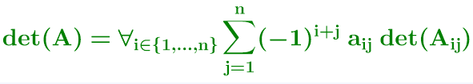
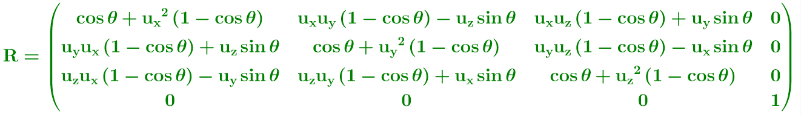

<p align="center">
    
</p>

## Interactive-Comments
**Interactive Comments** is a plug-in for Visual Studio that improves interactivity with your source code.  
You have **free 60-Day trial** to evaluate it, after which you have to purchase a license : https://www.interactive-comments.com/buy

## Install

You can install this extension in two different ways:
- By using the visual studio "Manage Extensions dialog" and searching **Interactive Comments** on the **Visual Studio Marketplace**
- By downloading the offline package directly on the following link : https://www.interactive-comments.com/download

## How to use
Just insert a xml <math> </math> tag in your comments, what ever the programming language used.  
You can find more information and example on the following link : https://www.interactive-comments.com/faq

## Features
### Tex Math expression 
&#9658; Real-time offline rendering  
&#9658; Analysis of mathematical tags in comments in real time  
&#9658; Low memory footprint  
&#9658; Silent tag parsing to avoid to slowdown the code writing   
&#9658; Final rendering image integration directly in the source code  
&#9658; Multi programming languages support : C++, C, C#, Python, F#, Fortran, Visual Basic, R, Assembly, Javascript / Typescript  
&#9658; Multi-lines support  

## C++ Examples
### --&#9658; Mono-line math tag
```cpp
// <math> det(A) = \forall_{i \in \{1, \dots, n\}}\sum_{j=1}^{n} (-1)^{i+j}\hspace{.3em}a_{ij} \hspace{.3em}det(A_{ij}) </math>
```

<p align="center">
    
</p>

### --&#9658; Multi-lines math tag
```cpp
// <math> R = \begin{pmatrix} 
// \cos \theta + u_x ^ 2 \left(1 - \cos \theta\right) & u_x u_y \left(1 - \cos \theta\right) - u_z \sin \theta & u_x u_z \left(1 - \cos \theta\right) + u_y \sin \theta & 0\\
//	u_y u_x \left(1 - \cos \theta\right) + u_z \sin \theta & \cos \theta + u_y ^ 2\left(1 - \cos \theta\right) & u_y u_z \left(1 - \cos \theta\right) - u_x \sin \theta & 0\\
//	u_z u_x \left(1 - \cos \theta\right) - u_y \sin \theta & u_z u_y \left(1 - \cos \theta\right) + u_x \sin \theta & \cos \theta + u_z ^ 2\left(1 - \cos \theta\right) & 0\\
//	0 &0 &0 &1
//	\end{pmatrix}
// </math>
```

<p align="center">
    
</p>
